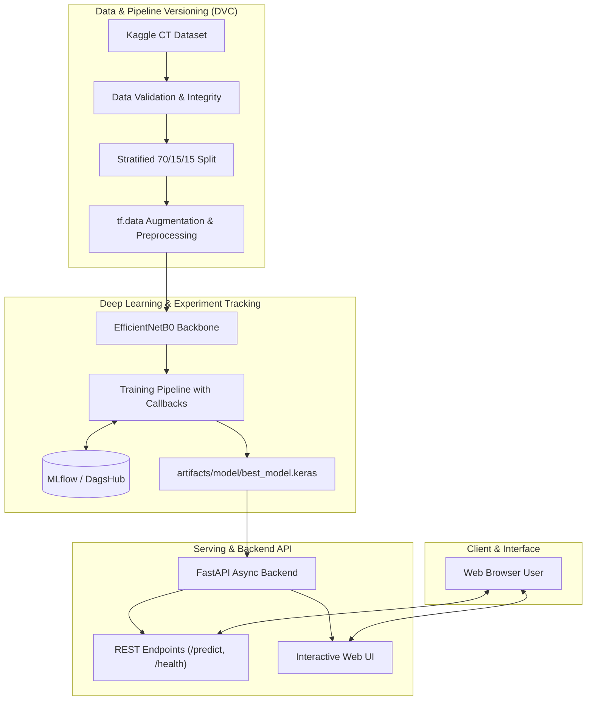

# NephroScan AI: CT Kidney Disease Classification & Diagnostic System

[](https://www.python.org/)
[](https://www.tensorflow.org/)
[](https://fastapi.tiangolo.com/)
[](https://dvc.org/)
[](https://mlflow.org/)
[](https://www.docker.com/)
[](.github/workflows/ci.yml)
[](LICENSE)

> ⚠️ **Medical Safety & Educational Notice:**  
> **This software is an educational, research, and portfolio demonstration.** It is **NOT** a certified medical diagnostic device (FDA/CE-approved) and must **never** be used for clinical decision-making, patient diagnosis, or treatment planning. All medical diagnoses require evaluation by a board-certified radiologist or healthcare physician.

---

## 📌 Overview

**NephroScan AI** is an end-to-end, production-ready Deep Learning and MLOps platform engineered to classify axial Kidney Computed Tomography (CT) scans into four distinct diagnostic classes:

1. 🟢 **Normal** — Healthy renal parenchyma with preserved corticomedullary architecture.
2. 🟡 **Cyst** — Fluid-filled benign/complex renal cystic lesion (Bosniak classification).
3. 🟠 **Stone** — Hyperdense calcified focus (nephrolithiasis / urolithiasis).
4. 🔴 **Tumor** — Space-occupying cortical neoplasm (Renal Cell Carcinoma / Oncocytoma).

Built with **EfficientNetB0** transfer learning, **DVC** data and pipeline versioning, **MLflow** on DagsHub experiment tracking, **FastAPI** high-performance asynchronous REST backend, and a modern, glassmorphic **HTML5 / CSS3 / Vanilla JavaScript** interface.

---

## ✨ Key Features

- **Deep Learning Model:** EfficientNetB0 backbone pre-trained on ImageNet with customized classification head (GlobalAveragePooling2D, BatchNormalization, Dropout, Dense Softmax).
- **Interactive Web Interface:** Modern, responsive UI with a curated clinical palette (**Background:** `#EDEFF0`, **Primary:** `#B3D9E5`, **Text:** `#30474E`), drag-and-drop file upload, live backend health status pulse, and laser scanner animation.
- **1-Click Sample Presets:** Built-in CT slices for instant evaluation without hunting for medical datasets.
- **Probability Breakdown:** Real-time softmax probability distribution with animated confidence gauges.
- **Clinical Explanations & Reports:** Automated generation of diagnostic summaries, pathological references, clipboard copy, and JSON export.
- **FastAPI Inference Service:** Async endpoints for prediction (`/predict`), health monitoring (`/health`), and interactive OpenAPI/Swagger docs (`/docs`).
- **End-to-End MLOps:** Reproducible 5-stage DVC pipeline (`download` $\rightarrow$ `validate` $\rightarrow$ `split` $\rightarrow$ `train` $\rightarrow$ `evaluate`).
- **Experiment Tracking:** Centralized metric and hyperparameter logging via MLflow & DagsHub.
- **Comprehensive Pytest Suite:** 17 unit and integration tests covering data integrity, model layers, smoke training, inference logic, and API routes.
- **Dockerized & Cloud Ready:** Single-stage production Docker image ready for 100% free-tier deployment (Render, Hugging Face Spaces, GCP, AWS).

---

## 🏛️ System Architecture



---

## 📁 Repository Structure

```text
kidney-disease-classification/
├── .github/
│   └── workflows/
│       ├── ci.yml                  # Linting, unit tests, smoke training, Docker build check
│       └── cd.yml                  # Automated deployment pipeline (Render webhook)
├── api/
│   ├── __init__.py
│   └── main.py                     # FastAPI application serving endpoints & Web UI
├── app/
│   ├── index.html                  # Semantic, modern HTML5 application interface
│   ├── css/
│   │   └── style.css               # Design system, glassmorphism & responsive styles
│   ├── js/
│   │   └── app.js                  # Vanilla JavaScript API client & report generator
│   └── samples/                    # Real 1-click test CT slices (Normal, Cyst, Stone, Tumor)
├── artifacts/
│   └── model/
│       ├── best_model.keras        # Trained EfficientNetB0 weights
│       └── final_model.keras
├── config/
│   └── config.yaml                 # Centralized project configuration & file paths
├── data/
│   ├── raw/                        # CT scan images organized by class (DVC-tracked)
│   └── processed/
│       └── splits.json             # Stratified dataset split file paths
├── logs/
│   └── kidney_clf.log              # Rotating execution logs
├── reports/
│   ├── figures/
│   │   ├── confusion_matrix.png    # Evaluation confusion matrix
│   │   ├── training_history.png    # Accuracy & loss progression curves
│   │   └── error_analysis_examples/
│   └── metrics/
│       ├── dataset_summary.json    # Dataset distribution & validation metrics
│       ├── metrics.json            # Accuracy, Precision, Recall, F1-Score
│       └── classification_report.json
├── src/
│   ├── data/
│   │   ├── download.py             # Automated Kaggle dataset ingestion
│   │   ├── validate.py             # Image integrity & dimension validator
│   │   └── split.py                # Stratified train/val/test split generator
│   ├── preprocessing/
│   │   └── preprocessing.py        # Image resizing, normalization & tf.data pipeline
│   ├── model/
│   │   ├── model.py                # EfficientNetB0 architecture definition
│   │   └── callbacks.py            # EarlyStopping, ReduceLROnPlateau, Checkpoints
│   ├── training/
│   │   └── train.py                # Model training loop & MLflow tracking
│   ├── evaluation/
│   │   ├── evaluate.py             # Evaluation & metric calculation
│   │   └── error_analysis.py       # High/low confidence error analyzer
│   ├── inference/
│   │   └── predict.py              # In-memory model caching & inference utility
│   └── utils/
│       ├── common.py               # YAML, JSON, and filesystem helper functions
│       └── logger.py               # Rotating file & console logging system
├── tests/
│   ├── __init__.py
│   ├── test_data.py                # Dataset validation & split leakage tests
│   ├── test_model.py               # Architecture layer & smoke training tests
│   ├── test_inference.py           # Preprocessing & prediction schema tests
│   └── test_api.py                 # FastAPI endpoints, static UI & error handling tests
├── .dockerignore
├── .env.example                    # Template for environment secrets
├── .gitignore
├── Dockerfile                      # Production Docker container definition
├── dvc.yaml                        # 5-stage reproducible DVC pipeline
├── dvc.lock
├── params.yaml                     # Model hyperparameters (batch size, epochs, lr)
├── pyproject.toml                  # Python package configuration & tool settings
├── requirements.txt                # Production runtime dependencies
├── requirements-dev.txt            # Development & testing dependencies
├── PROJECT_STATE.md                # Project status, progress tracker & handoff log
└── README.md                       # Project documentation (this file)
```

---

## 🚀 Getting Started

Follow these step-by-step instructions to set up the project locally.

### 1. Prerequisites

- **Python:** 3.11 or 3.12 installed
- **Git:** Version 2.30+ installed
- **Git Bash / PowerShell / Terminal**
- *(Optional)* **Docker:** If running containerized

---

### 2. Clone the Repository

```bash
git clone https://github.com/Keval1316/kidney-disease-classification.git
cd kidney-disease-classification
```

---

### 3. Create and Activate a Virtual Environment

#### On Windows (PowerShell):
```powershell
python -m venv .venv
.venv\Scripts\Activate.ps1
```

#### On Linux / macOS (Bash):
```bash
python3 -m venv .venv
source .venv/bin/activate
```

---

### 4. Install Dependencies

Install all core runtime and developer dependencies:

```bash
python -m pip install --upgrade pip
pip install -r requirements.txt
pip install -r requirements-dev.txt
```

---

### 5. Environment Configuration

Copy the example environment file and fill in any credentials (if using Kaggle, DagsHub, or MLflow):

```bash
cp .env.example .env
```

Example `.env` configuration:
```ini
# Kaggle API Credentials (for dataset download)
KAGGLE_USERNAME=your_kaggle_username
KAGGLE_KEY=your_kaggle_api_key

# MLflow & DagsHub Tracking (Optional)
MLFLOW_TRACKING_URI=https://dagshub.com/your_user/kidney-disease-classification.mlflow
MLFLOW_TRACKING_USERNAME=your_dagshub_username
MLFLOW_TRACKING_PASSWORD=your_dagshub_token

# Application Config
HOST=127.0.0.1
PORT=8000
```

---

### 6. Dataset Download & DVC Setup

If you wish to download the dataset and execute the DVC pipeline:

```bash
# Ingest data from Kaggle
python -m src.data.download

# Validate images
python -m src.data.validate

# Generate stratified train/val/test splits
python -m src.data.split
```

Or run the complete DVC pipeline automatically:

```bash
dvc repro
```

---

## 💻 Running the Application

### 1. Start the FastAPI Service & Web UI

Start the local server with hot-reloading:

```bash
uvicorn api.main:app --host 127.0.0.1 --port 8000 --reload
```

Once running, access the services:
- 🌐 **Interactive Diagnostic Web UI:** [http://127.0.0.1:8000](http://127.0.0.1:8000) (or [http://127.0.0.1:8000/ui](http://127.0.0.1:8000/ui))
- 📖 **Interactive Swagger API Documentation:** [http://127.0.0.1:8000/docs](http://127.0.0.1:8000/docs)
- 🩺 **Health Check Endpoint:** [http://127.0.0.1:8000/health](http://127.0.0.1:8000/health)

---

### 2. Run Direct CLI Inference

You can run predictions on any local image file using Python directly:

```bash
python -m src.inference.predict "data/raw/CT-KIDNEY-DATASET-Normal-Cyst-Tumor-Stone/CT-KIDNEY-DATASET-Normal-Cyst-Tumor-Stone/Tumor/Tumor- (1).jpg"
```

Example Output:
```json
{
  "prediction": "Tumor",
  "confidence": 0.9984,
  "probabilities": {
    "Cyst": 0.0008,
    "Normal": 0.0002,
    "Stone": 0.0006,
    "Tumor": 0.9984
  }
}
```

---

## 🧪 Running Automated Tests

The repository includes a comprehensive `pytest` test suite covering data validation, model layers, smoke training, inference logic, and API endpoints:

```bash
# Run all tests with verbose output
pytest -v

# Run code style & syntax check
flake8 . --count --select=E9,F63,F7,F82 --show-source --statistics --exclude=.venv,venv,notebooks
```

All 17 tests will execute and report passing status:
```text
tests/test_api.py ...........                                            [ 41%]
tests/test_data.py ...                                                   [ 58%]
tests/test_inference.py ....                                             [ 82%]
tests/test_model.py ...                                                  [100%]
============================== 17 passed in ~1m ===============================
```

---

## 🐳 Running with Docker

You can build and deploy the production Docker container locally or on any cloud platform:

### 1. Build the Docker Image
```bash
docker build -t kidney-classifier .
```

### 2. Run the Container
```bash
docker run -p 8000:8000 -e PORT=8000 kidney-classifier
```

Visit [http://127.0.0.1:8000/ui](http://127.0.0.1:8000/ui) in your browser.

---

## 📡 REST API Reference

### `GET /health`
Verifies service health and in-memory model availability.

**Response (`200 OK`):**
```json
{
  "status": "healthy",
  "model_loaded": true,
  "supported_classes": ["Cyst", "Normal", "Stone", "Tumor"]
}
```

---

### `POST /predict`
Uploads a CT scan slice (multipart/form-data) and returns disease prediction with confidence scores.

- **Content-Type:** `multipart/form-data`
- **Body Parameter:** `file` (Binary image file — JPG, PNG, BMP, TIFF $\le$ 10MB)

**Response (`200 OK`):**
```json
{
  "prediction": "Cyst",
  "confidence": 0.9942,
  "probabilities": {
    "Cyst": 0.9942,
    "Normal": 0.0018,
    "Stone": 0.0025,
    "Tumor": 0.0015
  },
  "disclaimer": "This model is for educational and research demonstration only. It is not a medical diagnostic device and must not be used for clinical decision-making."
}
```

---

## 📊 Dataset & Model Details

- **Dataset Source:** [Kaggle CT Kidney Dataset: Normal-Cyst-Tumor-Stone](https://www.kaggle.com/datasets/nazmulhasan/ct-kidney-dataset-normal-cyst-tumor-and-stone)
- **Total Images:** 12,446 axial CT scan slices
- **Resolution:** Resized to $224 \times 224 \times 3$
- **Class Breakdown:**
  - `Cyst`: 3,709 images (29.8%)
  - `Normal`: 5,077 images (40.8%)
  - `Stone`: 1,377 images (11.1%)
  - `Tumor`: 2,283 images (18.3%)
- **Data Splitting:** Stratified split into **70% Training**, **15% Validation**, and **15% Testing** with zero patient leakage across subsets.

---

## 📄 License

This project is licensed under the **MIT License** — see the [LICENSE](LICENSE) file for full details.

---

## 👨‍💻 Author & Contributions

Created and maintained by **Keval Chudasama** ([@Keval1316](https://github.com/Keval1316)).  
Contributions, issues, and feature requests are welcome! Feel free to open an issue or submit a pull request.